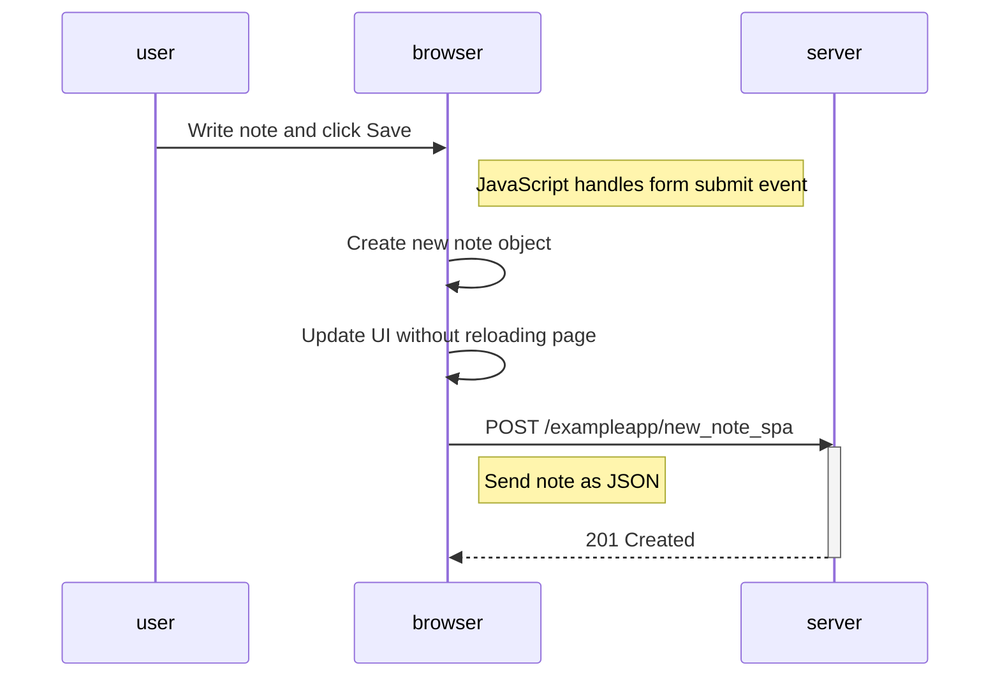

# Exercise 0.6

```mermaid
sequenceDiagram
    participant user
    participant browser
    participant server

    user->>browser: Write note and click Save

    Note right of browser: JavaScript handles form submit event

    browser->>browser: Create new note object

    browser->>browser: Update UI without reloading page

    browser->>server: POST /exampleapp/new_note_spa
    activate server

    Note right of browser: Send note as JSON

    server-->>browser: 201 Created

    deactivate server
```